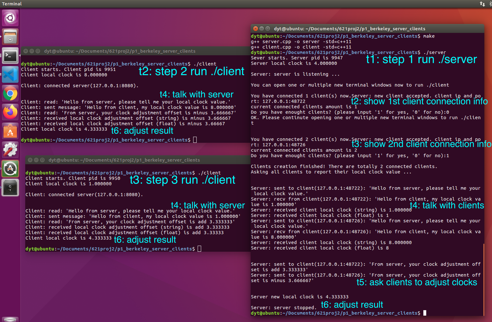

# berkeley-algorithm-implementation
Cpp implementation of Berkeley algorithm for clock synchronization in distributed systems.

## Environments:

All tests are on Ubuntu 16.04 LTS, g++ (Ubuntu 5.4.0-6ubuntu1~16.04.12) 5.4.0 20160609.


# 1. Background Knowledge Review

## 1.1 Synchronization, Clock Synchronization, Berkeley Algorithm
Synchronization is the core issue for distributed systems. Synchronization in DS is archieved via clocks. 

Two popular clock synchronization ways for DS are:
- Christian's algorithm, which is absolute synchronization via connecting to UTC (Universial Time Coordinator)
- Berkeley algorithm, which is relative synchronization without central time-server (like UTC). It uses arithmetic mean value as new time for everyone, so it is actually averaging algorithm.

In DS, absolute time is less important. Clock synchronazation doesn't need to be absolute. DS care more about orders. So Berkeley Algorithm is more useful in DS than Christian's.


## 1.2 Steps for the Berkeley algorithm (Averaging algorithm)
1. The time daemon asks all the other machines for their clock values. 
2. The machines answer.
3. The Time daemon tells everyone how to adjust their clock.


[(This image credits to UPenn.)](https://www.cis.upenn.edu/~lee/07cis505/Lec/lec-ch6-synch1-PhysicalClock-v2.pdf)

# 2. Implementation

The key task is to creat multiple process and implement inter-process communication. Inter-process communication has multiple ways: pipes, shared memory, mmaped file and message passing (socket). I used message passing (socket) since we are simulating distributed systems here.

I used a **server-clients structure**, like the below figure:


I re-used pieces of code of our [proj1 bank account management](https://github.com/DayuanTan/DistributedOS-A-Centralized-Multi-User-Concurrent-Bank-Account-Manager-Multithread-Synchronization) which is also server-clients structure. 

The only difference is we don't need to create a thread for each connection.  
The server can be time daemon while clients can be other nodes in this DS.

## Compile

Just ```make``` under dir ["p1_berkeley_server_clients"](p1_berkeley_server_clients).

## Server side

Run ```./server``` under dir ["p1_berkeley_server_clients"](p1_berkeley_server_clients).

In [server.cpp](p1_berkeley_server_clients/server.cpp) I firstly setup normal socket and keep it listening.

Then there is a while loop which waiting for clients connections.
When you open a new terminal window and run ```./client``` it will catch connections from clients. At the bottom part of this while loop it asks you where you have enough clients, if yes this while loop will stop. Clients connection information will be stored into vectors ```client_sockets```, ```client_ips``` and ```client_ports```.

After confriming all clients have connected, then is the communication between serer and clients. The sever will send message to client asking for their lock clock value and sttore them into a vector ```clients_local_clocks```. A for loop is used to iterate all client connections.


Then the server calculate the average value of all clock values, including itself, and how to adjust for each node. Then a for loop is used to send this adjustment offset to each client accordingly.

Then the server adjust itself's clock.

## Client sides

Each time you run ```./client``` under dir ["p1_berkeley_server_clients"](p1_berkeley_server_clients) in a new opened terminal window, it creates a new client process.

In [client.cpp](p1_berkeley_server_clients/client.cpp) it first connect to server whose ip and port is hard-coded. Then waiting for server's message.

The first message it receives from server would be asking for its local clock value and the client will reply it. Then wait for new message from server.

The second message it receives from server would be how to asjust its clock and the client will do it. Then the client would have correct clock now.

At this moment, the server and all clients have clock synchronization.


The below screenshot shows how I ran it with 2 clients. 


